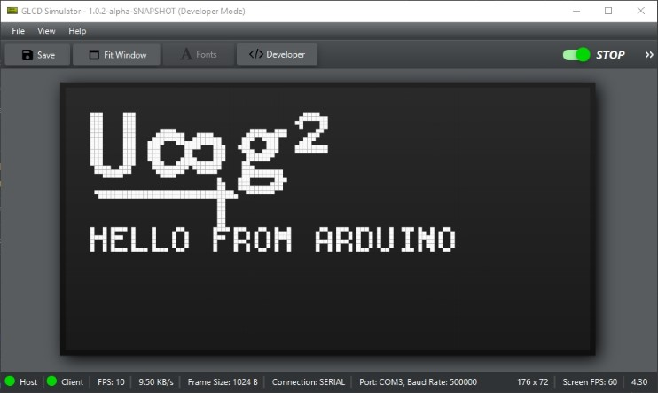
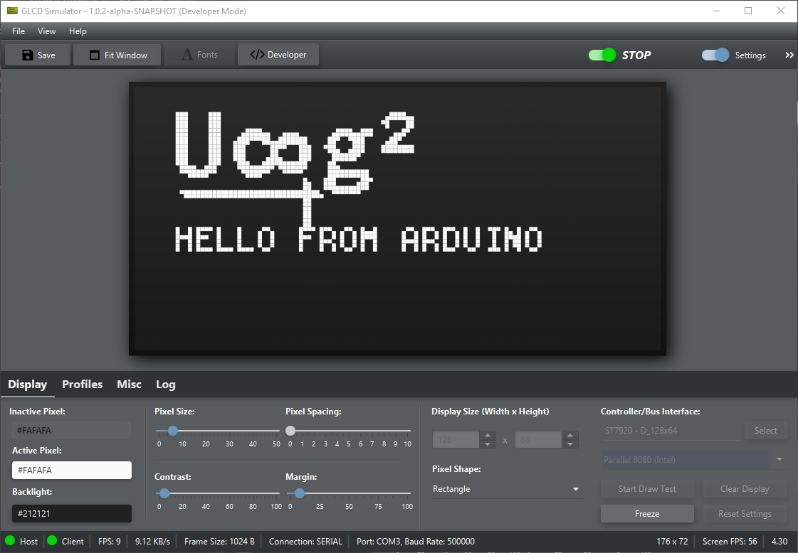
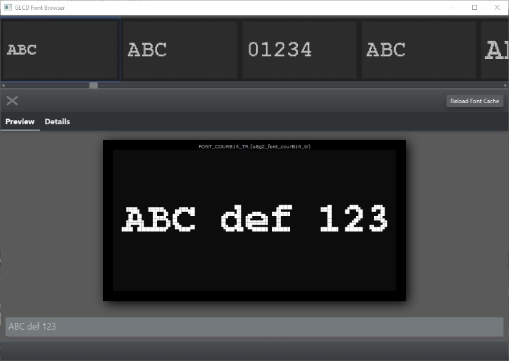
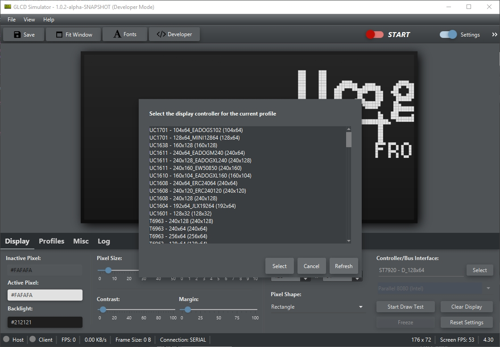
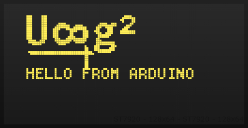
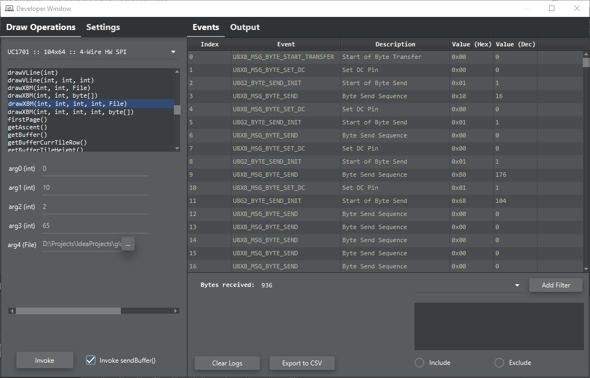
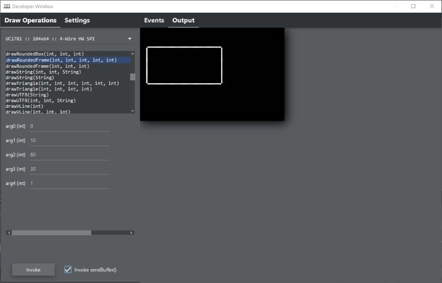
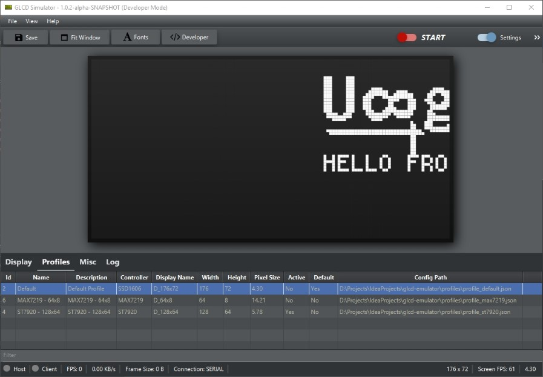

## Graphics LCD Simulator

## Requirements

- Java 8 or higher

## Client libraries

- [Arduino client](https://github.com/ribasco/glcd-emulator-client-arduino)
- [Java client (Using ucgdisplay)](https://github.com/ribasco/glcd-emulator-client-java)
- C/C++ (Coming soon)

## Installation

Under construction

## Usage

Under construction

## Limitations

Under construction

## Features

#### Cross-platform

Supports Windows, Mac OSX and Linux

#### Supports arduino/c/c++ and java clients

#### Customizable look and feel

#### Font Browser

Browse through all available u8g2 fonts

#### Supports over 40+ displays

#### Screenshots

Save current display as PNG format

#### Developer mode

In developer mode, allows you to play around with the functions provided by u8g2 and inspect the instructions generated.

#### Profile Support

For different configuration setups, you can store individual settings in their own profile.

